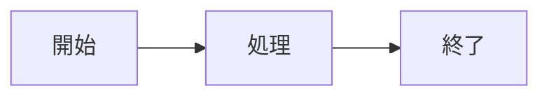

# 記事生成アプリ - Article Generator

Gemini 2.5 Flash を使用した日本語記事自動生成アプリケーション。

## 概要

このアプリケーションは、Google の Gemini 2.5 Flash AI モデルを使用して、高品質な日本語記事を自動生成します。

### 主な機能

- **メタ情報自動提案**: テーマやキーワードから、記事の対象読者、目的、トーン、長さなどを AI が提案
- **ストリーミング生成**: リアルタイムで記事が生成され、エディタに表示
- **ライブプレビュー**: Markdown、Mermaid 図表、LaTeX 数式をリアルタイムでプレビュー
- **編集機能**: 生成された記事を自由に編集可能
- **自動保存**: 編集内容を IndexedDB に自動保存（2秒ごと）
- **下書き管理**: 保存された下書きの一覧表示・復元・削除
- **スタイルバリデーション**: note.com 規約に準拠しているかリアルタイムチェック
- **ダークモード**: ライト/ダーク/システム設定の3モード対応
- **エクスポート**: Markdown ファイル (.md) としてダウンロード
- **レスポンシブデザイン**: デスクトップとモバイルの両方に対応

### 技術スタック

- **Next.js 15** (App Router)
- **TypeScript** (strict mode)
- **Tailwind CSS v4**
- **shadcn/ui** (アクセシブルな UI コンポーネント)
- **Gemini 2.5 Flash** (@google/generative-ai)
- **React Markdown** (Mermaid, KaTeX 対応)
- **IndexedDB** (ローカルストレージ)

## セットアップ

### 前提条件

- Node.js 20.x 以上
- npm

### インストール

```bash
# 依存関係をインストール
npm install

# 開発サーバーを起動
npm run dev
```

開発サーバーは `http://localhost:3000` で起動します。

### Gemini API キーの取得

1. [Google AI Studio](https://aistudio.google.com/app/apikey) にアクセス
2. API キーを作成
3. **重要**: HTTP リファラ制限を設定
   - API キー設定 → アプリケーションの制限 → HTTP リファラ
   - 許可するリファラ: `http://localhost:3000/*` (開発時)
   - 本番環境では本番ドメインを追加

## 使い方

### 1. API キーの設定

初回起動時、または右上の「API キー設定」ボタンから、Gemini API キーを設定します。

### 2. 記事のテーマ入力

記事のテーマやキーワードを入力します。

例:
```
AIエージェントの最新トレンドについて、技術者向けに解説する記事を書きたい
```

### 3. メタ情報の確認・編集

AI が以下の 6 つのメタ情報を提案します：

- テーマ/タイトル
- 対象読者
- 記事の目的
- トーン
- 記事の長さ
- 特別な指示

提案内容を確認し、必要に応じて編集できます。

### 4. 記事生成

「承認して記事生成」をクリックすると、AI がストリーミング形式で記事を生成します。
生成中もリアルタイムでプレビューが更新されます。

### 5. 編集とエクスポート

- 生成された記事は自由に編集可能
- プレビューは Markdown、Mermaid 図表、LaTeX 数式に対応
- 「.md エクスポート」ボタンで Markdown ファイルとしてダウンロード

## 記事スタイルガイド

生成される記事は note.com の規約に準拠します：

### 見出し形式

- タイトル: `#` (1つのハッシュタグ)
- 大見出し: `##` (2つのハッシュタグ)
- 小見出し: `###` (3つのハッシュタグ)
- それ以下の見出しは太字 + 番号で表現

### 表の記載

LaTeX array 形式を使用：

```latex
$$
\begin{array}{|l|l|} \hline
\textbf{項目} & \textbf{説明} \\ \hline
\text{例1} & \text{説明1} \\ \hline
\end{array}
$$
```

### 図解

Mermaid 記法を使用：

````markdown

````

## プロジェクト構成

```
src/
├── app/
│   ├── layout.tsx          # ルートレイアウト
│   ├── page.tsx            # メインページ
│   └── globals.css         # グローバルスタイル
├── components/
│   ├── ui/                 # shadcn/ui コンポーネント
│   ├── api-key-dialog.tsx  # API キー設定ダイアログ
│   ├── meta-input-form.tsx # メタ情報入力フォーム
│   ├── meta-approval-dialog.tsx # メタ情報承認ダイアログ
│   ├── markdown-editor.tsx # Markdown エディタ
│   └── markdown-preview.tsx # プレビューレンダラー
├── lib/
│   ├── utils.ts            # ユーティリティ関数
│   ├── prompts.ts          # プロンプト管理
│   ├── gemini.ts           # Gemini API ラッパー
│   ├── db.ts               # IndexedDB 操作
│   └── export.ts           # エクスポート機能
└── types/
    └── domain.ts           # ドメイン型定義
```

## ビルド

```bash
# プロダクションビルド
npm run build

# ビルドした内容を実行
npm start
```

## セキュリティに関する注意

### API キー管理

- API キーはブラウザのローカルストレージに保存されます
- **必ず HTTP リファラ制限を設定してください**
- 本番環境では、バックエンドプロキシ経由での API 呼び出しを推奨

### XSS 対策

- Markdown/HTML/SVG は厳格にサニタイズされます
- Mermaid は `securityLevel: strict` で実行
- KaTeX は信頼できない HTML を生成しない設定

## 実装済み機能

### ✅ コア機能
- メタ情報提案（6項目のJSON生成）
- ストリーミング記事生成
- Markdown エディタ
- ライブプレビュー（Markdown + Mermaid + KaTeX）

### ✅ データ管理
- IndexedDB 自動保存（2秒間隔）
- 下書き一覧・復元・削除
- 最終保存時刻表示

### ✅ スタイル管理
- note.com 規約準拠チェック
  - 見出し構造バリデーション
  - 句点（。）チェック
  - LaTeX 表形式チェック
  - 図解頻度ガイド
- リアルタイムバリデーション結果表示

### ✅ UI/UX
- ダークモード切り替え（ライト/ダーク/システム）
- レスポンシブデザイン（デスクトップ: スプリット / モバイル: タブ）
- .md エクスポート

## ライセンス

このプロジェクトは設計書 (docs/design.md) に基づいて実装されています。

## 今後の拡張予定

- PDF エクスポート機能
- バージョン履歴・比較機能
- 同期スクロール機能
- 参照文献管理
- 共同編集機能（CRDT）
