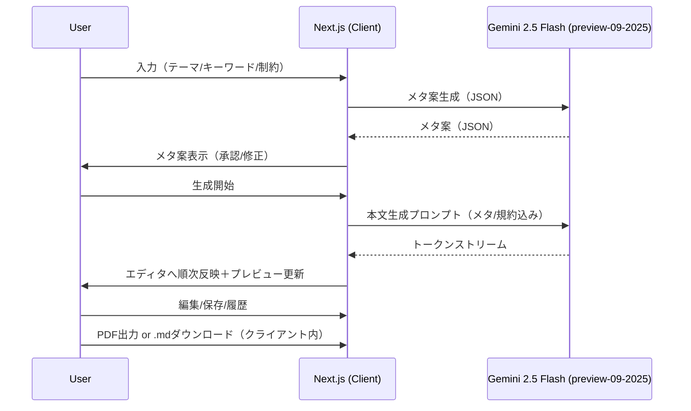
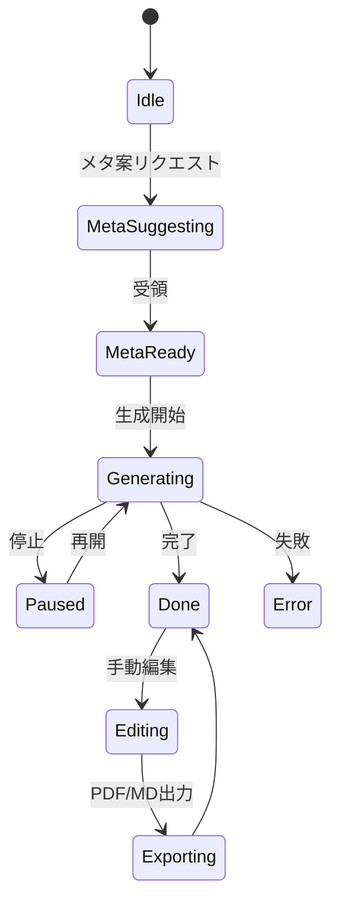

# 記事生成アプリ 設計書 v1.0（Gemini 2.5 Flash（API: `gemini-2.5-flash-preview-09-2025`）／Markdownエディタ連携）

作成日: 2025-10-01（JST）
作成者: ポノテク株式会社
対象読者: プロダクトマネージャー／UXデザイナー／フロントエンド／バックエンド／SRE／セキュリティ担当。

---

## 0. 目的・背景

ユーザー入力から **Gemini 2.5 Flash（API: `gemini-2.5-flash-preview-09-2025`）** を用いて記事（Markdown）を自動生成し、**プレビュー機能付きMarkdownエディタ**で編集・確認・エクスポート（**PDF / .md**）できるアプリを開発する。本設計書は、機能要件・非機能要件・アーキテクチャ・データ・API・UXフロー・セキュリティ・運用・受け入れ基準を定義する。

---

## 1. スコープ

* 本バージョンは **Next.js（App Router）+ TypeScript** ベースの**フロントエンドのみ構成**。**カスタムバックエンドは無し**（API呼び出し・保存・エクスポートはブラウザ内で完結）。
* UI/スタイリングは **Tailwind CSS v4** と **shadcn/ui** を採用（Radix Primitives 準拠のアクセシビリティを確保）。
* 生成モデルは **Gemini 2.5 Flash（API: `gemini-2.5-flash-preview-09-2025`）** を使用し、**@google/genai** ライブラリで**クライアントから直接**呼び出す（鍵のリファラ制限・クォータ等は §13 を参照）。
* エディタは**Markdown編集＋ライブプレビュー**（SVG/Mermaid/LaTeX対応）、**同期スクロール**、**ストリーミング出力**表示を含む。
* エクスポート: **PDF／.md** ともに**クライアントサイド**で生成・ダウンロード。

---

## 2. 想定ユーザー／主ユースケース

**ユーザー像**: ブロガー、企業の広報/マーケ、技術ライター、研究者/学生、ノート記事投稿者。

**主要ユースケース**:

1. 入力フォームからテーマやキーワードを入力 → AIが**メタ情報案**（タイトル/対象読者/目的/トーン/長さ/特別指示）を提案 → ユーザーが承認/修正 → 記事生成を**ストリーミング**で受け取りつつ編集・プレビュー。
2. 図解（Mermaid・SVG）や数式（LaTeX）を多用した記事の**下書き〜仕上げ**。
3. **note.comの見出し規約**や**表（LaTeX array）**ルールに沿った記事リリース用原稿の作成。
4. PDF出力してレビュー／共有。もしくは **.md** をダウンロードして他CMSへ移管。

---

## 3. 要件

### 3.1 機能要件（FR）

* FR-01: ユーザー入力（テーマ/キーワード/制約など）を元に、AIがまず以下の**メタ情報案**を提示する。

  * 記事のテーマ/タイトル。
  * 対象読者（年齢層、興味、知識レベル）。
  * 記事の目的（情報提供/教育/エンタメ等）。
  * 希望トーン（カジュアル/フォーマル/会話調等）。
  * 記事の長さ（希望文字数）。
  * 特別な指示（用語の扱い/避ける表現等）。
* FR-02: メタ情報案が**承認**されると、定義済みプロンプトに従い**Markdown記事をストリーミング生成**し、**順次エディタ出力**する。
* FR-03: エディタは **Markdown** 編集に対応し、**プレビュー**は **SVG/Mermaid/LaTeX** を描画可能。**Markdown⇔プレビューの同期スクロール**を行う。
* FR-04: 生成テキストは**中断/再開**、**差分マージ**（AI出力→下書きへ反映）に対応。
* FR-05: **PDFエクスポート**（サーバサイドレンダリング）/**.mdダウンロード**（クライアント）に対応。
* FR-06: 記事の**スタイルポリシー**（note.com見出し規約、表のLaTeX array形式、箇条書きの使い方等）に準拠するよう**AIへ誘導**し、**Lint/バリデーション**も行う。
* FR-07: 図解（Mermaid）や数式（LaTeX）が含まれる記事の**安定描画**（テーマ切替・再レンダリング含む）。
* FR-08: 生成過程と最終記事の**履歴管理/復元**。
* FR-09: 参照URLや引用箇所の**メタ注記**フィールド（脚注/参考文献セクション）を付与できる。

### 3.2 非機能要件（NFR）

* NFR-01: ストリーミング遅延: 初回トークン<2秒、平均>15トークン/秒（ネットワーク条件に依存）。
* NFR-02: PDF生成はA4/レター/カスタムサイズ対応、100ページ相当でもタイムアウトしない設計（ジョブ化・再試行）。
* NFR-03: プレビューの再描画（Mermaid/KaTeX）は**1秒以内**に体感的に開始。
* NFR-04: セキュリティ: XSS防止（Markdown/HTML/SVGサニタイズ）、CSRF対策、権限管理、秘密情報の安全保管。
* NFR-05: 可用性: 99.9%/月（ミニマム構成時はSLA対象外でも設計上担保）。
* NFR-06: 可観測性: 主要イベントのメトリクス・分散トレース・構造化ログを整備。

---

## 4. 全体アーキテクチャ

```mermaid
flowchart LR
  U[User (Browser)] -- HTTPS --> FE[Next.js + TypeScript
(Tailwind v4, shadcn/ui)]
  FE -- WebWorker / Streaming --> GAI[@google/genai
 gemini-2.5-flash-preview-09-2025]
  FE -- IndexedDB --> IDB[(Local Store: drafts, sessions, exports)]
  FE -- in-browser --> EXP[Client Exporter (HTML→PDF, .md)]
```

**要点**

* **バックエンド無し**。ストリーミングは **@google/genai** のストリーム API（ReadableStream）をクライアントで処理。
* データ保存は **IndexedDB/LocalStorage**（自動保存・復元）。
* PDF 生成はブラウザ内レンダリング（CSS Paged Media / Canvas ベース）で実施。

---

## 5. コンポーネント構成

### 5.1 フロントエンド

* **フレームワーク**: Next.js（App Router） + **TypeScript**。
* **UI/スタイル**: **Tailwind CSS v4**（デザイントークン化、ダークモード、タイポグラフィ調整）＋ **shadcn/ui**（Button/Dialog/Tabs/Tooltip/DropdownMenu/Separator/ScrollArea/Toast/Progress/Badge/Input/Switch/Slider/Form 等）。
* **主要UI**:

  * **MetaForm（Dialog）**: 6項目のメタ案を表示・編集・確定。
  * **StreamPane（Toast/Progress/Badge）**: ストリーミング状態（受信速度・残量目安）を提示。
  * **MarkdownEditor（Textarea or Code-like editor）**: 見出しアウトライン、差分表示、ショートカット。
  * **PreviewRenderer（Tabs/ScrollArea）**: Markdown→HTML、**SVG/Mermaid/KaTeX**描画、テーマ切替、**同期スクロール**。
  * **ExportPanel（Dialog/Select）**: PDF/MD 出力設定（用紙・余白・ヘッダ/フッタ）。
  * **History/Versioning（Drawer/List）**: 生成履歴、復元、比較。
* **レイアウト**: 可変幅スプリットペイン（エディタ/プレビュー）とし、狭幅時は Tabs 切替。

### 5.2 クライアント・ユーティリティ（フロントのみ） クライアント・ユーティリティ（フロントのみ）

* **Prompt Orchestrator（Client）**: メタ案→本文生成までのプロンプト整形、スタイルポリシー注入、追促プロンプト。
* **Stream Controller（Client Worker）**: SDK/Fetch のストリームを受け、**逐次エディタへ反映**・部分保存・停止/再開。
* **Validator/Linter（Client）**: 見出し規約・LaTeX array・句点・図解頻度のチェックと UI 通知。
* **Exporter（Client）**: Markdown→HTML→**ブラウザ内PDF**、.md 直ダウンロード、ページ設定。
* **Persistence（Client）**: IndexedDB（本文・メタ・セッション・エクスポート履歴）。

### 5.3 LLMプロバイダ（クライアントSDK）

* **Gemini API** は **@google/genai** をクライアントから直接利用。
* **モデル**: `gemini-2.5-flash-preview-09-2025`（テキスト生成・ストリーミング対応）。
* **制御**: 生成停止・温度/最大長・安全設定・JSONモード（メタ案）等のパラメタ管理を UI から行う。
* **鍵管理**: API Key は**HTTPリファラ制限**を必須（詳細は §13）。

---

## 6. データ設計（主要エンティティ）

```mermaid
erDiagram
  USER ||--o{ DRAFT : creates
  DRAFT ||--|{ SESSION : has
  DRAFT ||--o{ REFERENCE : cites
  DRAFT ||--o{ EXPORT : outputs

  USER {
    string id
    string email
    string name
  }
  DRAFT {
    string id
    string title
    string markdown
    json   meta    // 対象読者/目的/トーン/長さ/特別指示
    json   style   // レンダリング設定、テーマ
    time   updated_at
  }
  SESSION {
    string id
    string draft_id
    string status   // running|stopped|done|error
    json   prompt   // 実際に送信したプロンプト全文
    json   tokens   // 受信済みトークン/チャンク
    time   started_at
    time   ended_at
  }
  REFERENCE {
    string id
    string draft_id
    string label
    string url
    string note
  }
  EXPORT {
    string id
    string draft_id
    string type     // pdf|md
    string url      // 完成ファイル保存先
    string status   // queued|working|done|error
    time   created_at
  }
```

**備考**: Markdown本文とは別に**meta**（ヘッダ情報）や**prompt**（送信記録）を保持し、再現性を担保する。保存先は**IndexedDB（ブラウザ内）**とし、必要に応じてエクスポート/インポートを提供する。

---

## 7. クライアント動作設計（APIレス構成）

**内部アクション（例）**

* `meta.suggest(start)` : 入力（テーマ/キーワード等）→ **@google/genai** によるメタ情報案要求（JSON構造）。
* `meta.suggest/apply` : UIで承認/修正→確定。
* `article.stream(start|pause|resume|stop)` : 確定メタ＋追加指示→**ストリーミング生成**開始/制御（ReadableStream を順次反映）。
* `draft.save(auto|manual)` : 本文・メタを IndexedDB へ保存。
* `export.md()` : 現在の Markdown を Blob 化しクライアント DL。
* `export.pdf(opts)` : HTML→PDF を**クライアント内**で実行、DL。
* `history.restore(versionId)` : 履歴から復元。

**外部API**

* **@google/genai**（`gemini-2.5-flash-preview-09-2025`）へのクライアント直呼び出し（Streaming）。

---

## 8. プロンプト設計

### 8.1 メタ情報案プロンプト（要約）

* 目的: 入力から、下記6項目を**日本語**で推定・提案。

  1. 記事のテーマ/タイトル。 2) 対象読者。 3) 目的。 4) トーン。 5) 長さ。 6) 特別な指示。
* 返却形式: 構造化（JSON もしくはYAML）。UIにそのまま差し込んで**承認/修正**可能。

### 8.2 本文生成プロンプト（ユーザー指定）

以下の**ユーザー指定プロンプト**を**System/Developer**コンテキストに組み込み、Userにメタ情報・追記指示を与えて生成する。

```
# 記事の構成
1. 魅力的な見出し（複数のバリエーションを提案）
2. 読者の興味を引く導入部
3. 論理的に整理された本文（見出しと小見出しを使用）
4. 要点をまとめた結論部分

# 記事の質を高めるための要素
- 独自の視点や切り口を含める
- 具体的な例や事例を盛り込む
- 読者に価値を提供する実用的な情報を含める
- 会話調の文体や読者に語りかける表現を取り入れる
- 適切な引用元や参考資料を提示する
- 専門用語は引用の形式で説明を加えること
- 記事の内容を補足するような図解をSVGやmermaid記法で頻繁に加えること
- 箇条書きは、ポイントを並べる時に使用し、それ以外では文章でなるべく説明すること

# 編集のポイント
- 事実確認と情報の正確性を確保する
- 文体と表現の一貫性を維持する
- 冗長な部分や一般的すぎる表現を避ける
- 読みやすさを重視（短い文、明確な表現）
- 個人的なエピソードや体験談を追加する余地を残す
- 文末を必ず句点で終わること

# note.comの見出し形式
- タイトル: # （1つのハッシュタグ）
- 大見出し: ## （2つのハッシュタグ）
- 小見出し: ### （3つのハッシュタグ）
- 小見出しの下にさらに小見出しを設けたい場合は、見出しにするのではなく、文字を太字にし、先頭に"(1)", "(2)"のように番号を付けること

# 表の記載方法
表を使用する場合、以下のようにLaTeX形式で記載すること（アンダースコアはエスケープ）。

$$  
\begin{array}{|l|l|l|} \hline  
\textbf{機能} & \textbf{OpenAI Agents SDK} & \textbf{Mastra} \\ \hline  
\text{エージェント定義} & \text{Python関数とデコレータ} & \text{TypeScriptクラスとインスタンス} \\ \hline  
\text{LLM連携} & \text{OpenAI APIに最適化} & \text{Vercel AI SDKによる複数プロバイダ対応} \\ \hline  
\text{ツール実装} & \text{関数デコレータ (@function\_tool)} & \text{スキーマと実行関数を持つ型付きオブジェクト} \\ \hline  
\text{ハンドオフ} & \text{組み込み機能として提供} & \text{エージェント間で明示的に実装} \\ \hline  
\text{実行フロー} & \text{組み込みエージェントループ} & \text{ワークフローグラフまたはエージェント呼び出し} \\ \hline  
\text{並列処理} & \text{Pythonの非同期機能} & \text{メソッドチェーンによる並列・直列処理} \\ \hline  
\end{array}  
$$
```

* 付与方針: **System**にスタイル・レギュレーションを固定、**User**に記事テーマ/メタ/追記。**Developer**でレンダリング上の注意（数式/表/図解の頻度）を補強。
* 検証: 出力に`#`の階層・句点・表のLaTeX・Mermaidブロックの有無など**Lint**を適用し、逸脱時は**追促プロンプト**で補正。

---

## 9. フロー設計

### 9.1 ユーザーフロー（概要）



### 9.2 同期スクロール設計（アルゴリズム） 同期スクロール設計（アルゴリズム）

* Markdownを**AST解析**して各ノード（段落/見出し/コード/表/数式）に**ソースオフセット**を付与。
* プレビュー側も**DOMノード**に対応する**offsetTop**をマップ化。
* エディタscroll→該当ASTノードを計算→プレビュー側で最も近いDOMノードへ`scrollTop`を補間移動（逆方向も同様）。
* 遅延レンダリング（Mermaid/KaTeX）後は**再マッピング**。

---

## 10. Markdown/プレビュー描画設計

* **Markdownパース**: CommonMark+GFM相当。脚注/タスクリスト/表/絵文字を含む。
* **LaTeX**: `$...$`（インライン）/`$$...$$`（ブロック）。**KaTeX**等でレンダリング。数式未閉じ時の**保全**（エラー表示/自動閉じ提案）。
* **Mermaid**: ```mermaid ブロックを検出→`mermaid.initialize()`→安全設定（security level strict相当）→SVG埋込→**DOMPurify**等でサニタイズ。
* **SVG**: `<svg>`と内部要素を許可リストでサニタイズ。
* **テーマ**: ライト/ダークの切替に伴いMermaid/KaTeXを**再描画**。
* **パフォーマンス**: バーチャルスクロール、差分レンダリング、画像の遅延読込。

---

## 11. エクスポート設計

* **.md**: 現在のエディタ内容を Blob 化して**クライアントでダウンロード**（UTF-8）。
* **PDF（クライアント内）**:

  * 前処理: Markdown→HTML（同一レンダラをクライアントで実行）。
  * 描画: Mermaid/KaTeX を完了させた後、**CSS Paged Media もしくは Canvas ベース**で PDF 化。
  * オプション: 余白・ヘッダ/フッタ・目次、ダーク/ライトテーマ固定、用紙サイズ。
  * 長文対策: ページング最適化・遅延描画・分割出力（章ごと）。

---

## 12. バリデーション/Lint

* **見出し規約**（note.com準拠）: `#`は1つのみがタイトル、`##`以降の階層ルール、過剰な深さ禁止。
* **表**: LaTeX `array`使用の検出、アンダースコアエスケープの確認。
* **句点**: 文末句点の有無、冗長表現の検知（ガイド表示）。
* **図解**: Mermaid/SVGの出現頻度ガイド（一定間隔で差し込む提案）。
* **用語**: 初出時に引用形式で解説が入っているか。

---

## 13. セキュリティ/プライバシー（フロントエンドのみ構成の特記事項）

* **XSS対策**: Markdown→HTML/SVG は **厳格サニタイズ**。Mermaid は `securityLevel: strict`。KaTeX は信頼できない HTML を生成しない設定。
* **APIキー管理**: バックエンドが無いため、**ブラウザ内にキーを保持**。

  * **@google/genai** のキーは Google AI Studio で **HTTP リファラ制限（特定ドメインのみ許可）** を必須化。
  * 使用量のレート制限・請求監視・キーの**定期ローテーション**。
  * 盗難リスクのため、公開環境では**ゲスト利用に制限**や**日次クォータ**を設定。
  * 将来拡張: **エフェメラルキー発行の軽量ブローカー**を導入（任意／別途バックエンド化）。
* **CSRF/認証**: 本構成ではサインイン必須でなければ不要。将来のユーザー同期時は OIDC を採用。
* **個人情報**: 入力テキストの保存ポリシー（保存期間/ローカルのみ/明示的削除）を UI に表示。

---

## 14. 可観測性/運用（フロントエンド中心）

* **フロント計測**: 生成開始レイテンシ、トークン速度、プレビュー再描画時間、PDF生成時間、エラー分類を計測。
* **エラー収集**: ブラウザベースのエラートラッキング（例: フロント用 APM/SaaS）。
* **ユーザー同意**: 計測はクッキーバナー/同意で明示。

---

## 15. リリース計画（例）

* **M0**: 基本UI/メタ案→生成ストリーム→編集→プレビュー（Mermaid/LaTeX）→.md DL。
* **M1**: PDFエクスポート（非同期ジョブ）、履歴/復元、Lint強化、同期スクロール最適化。
* **M2**: 引用管理/脚注挿入支援、共同編集、テンプレ/スニペット、画像挿入（ローカル/SVG）。

---

## 16. 受け入れ基準（サンプル）

* [ ] メタ案6項目が**5秒以内**に表示されること（クライアント直呼び出し）。
* [ ] 生成本文が**1秒以内**に最初のチャンクを表示、以降**10+ トークン/秒**で更新されること。
* [ ] Mermaid/LaTeX/SVG を含む記事でプレビューが崩れないこと（テーマ切替時も再描画成功）。
* [ ] エディタ⇔プレビューの**同期スクロール**が大見出し単位で破綻しないこと。
* [ ] **.md ダウンロード**がワンクリックで実行できること。
* [ ] **PDF 生成**がブラウザのみで成功すること（50+ ページ相当でも分割出力で完了）。
* [ ] IndexedDB に**自動保存**され、リロード後も復元できること。
* [ ] XSS サニタイズが有効で、危険な要素をブロックできること。
* [ ] API キーは**リファラ制限**が設定されていることをドキュメントで確認できること。
* [ ] **TypeScript** 型の厳格モードでビルドが通過し、**shadcn/ui** の主要コンポーネントでキーボード操作が可能であること。

---

## 17. エラー処理/リカバリ

* **SSE切断**: 自動再接続（指数バックオフ）、続きトークンから再開。
* **LLMエラー**: プロンプト長過多→要約再送、レート制限→待機/再試行。
* **描画失敗**: Mermaid/KaTeX失敗時は該当ブロックを**安全表示**＋再描画ボタン。
* **PDF失敗**: ジョブ再試行（最大N回）、HTMLスナップショット保存。

---

## 18. アクセシビリティ/国際化

* キーボード操作、スクリーンリーダー対応、コントラスト比。
* UI文言のi18n、記事生成言語はメタ情報の言語に追従。

---

## 19. 将来拡張

* 参考文献の**自動整形**（脚注/APA/ISO690等）。
* ウェブ検索/RAGによる**根拠補強**（引用自動挿入）。
* バージョン管理/共同編集（CRDT）。
* テンプレートギャラリー、プロンプトレシピ共有。

---

## 付録A: UIワイヤーフレーム（テキスト）

* **編集画面**: 上部バー（メタ案ボタン / 生成開始 / 停止 / 保存 / エクスポート）。左: Markdownエディタ、右: プレビュー。下: ストリームログ/エラー。
* **メタ案モーダル**: 6項目をフォーム編集、OKで固定。
* **エクスポートダイアログ**: PDF設定（余白/ヘッダフッタ/目次）、.mdダウンロードボタン。

---

## 付録B: 状態遷移（簡易）



---

## 付録C: セキュアレンダリング要件（抜粋）

* Markdown→HTML: **DOMPurify**等でサニタイズ。SVGは属性許可リスト方式。
* Mermaid: `securityLevel`はstrict、外部画像/リンクは無効化。
* KaTeX: 信頼できないHTML生成を禁止。

---

## 20. 技術スタックとUIコンポーネント指針（TypeScript / Tailwind CSS v4 / shadcn/ui）

* **TypeScript**: 厳格モード。ドメインモデル（Draft/Session/Export/Reference 等）に型を付与し、ストリーミング・イベントも型安全に扱う。例外・エラー型を分類し UI に反映。
* **Tailwind CSS v4**: デザイントークン（色・余白・フォント・半径）を変数化し、ダーク/ライトのテーマ切替に追従。記事本文用のプローズスタイル、印刷用のスタイルスコープ、アクセシビリティ考慮のフォーカス可視化を標準化。
* **shadcn/ui**: Dialog/Drawer/Tabs/Tooltip/DropdownMenu/ScrollArea/Separator/Toast/Progress/Badge/Button/Input/Switch/Slider/Form を標準採用。フォーム検証メッセージ、ラベル、ヘルプテキストを一貫したパターンで表示。キーボード操作・ARIA 属性の既定値を尊重。
* **情報設計**: メタ案モーダルはステップ化、承認後はバナーで固定値を常時可視化。右上ツールバーに「生成開始/停止/保存/エクスポート」。
* **レイアウト**: スプリットビュー（エディタ/プレビュー）は再配置可能。狭幅時は Tabs 切替。ヘッダ固定、フッタは進捗/トークン数。
* **状態管理**: 生成状態・プレビュー再描画状態・エクスポート状態を分離。重い処理は Web Worker へ委譲し UI の応答性を保持。
* **パフォーマンス**: バーチャルスクロール、差分レンダリング、Mermaid/KaTeX の遅延初期化、不要再描画の抑制。
* **国際化**: UI 文言は i18n 辞書で分離。記事本文の生成言語はメタ情報に追従。

